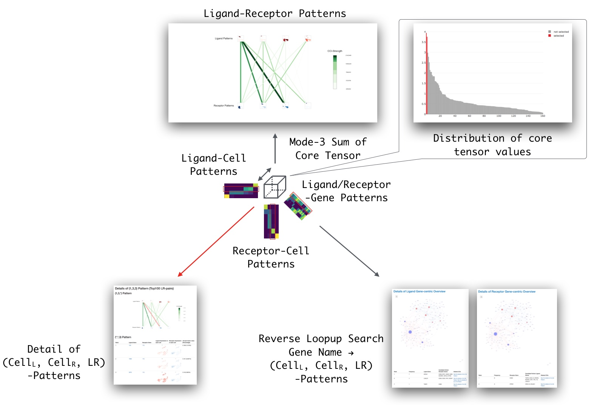

# Introduction
## About Cell-Cell Interaction (CCI)

Due to the rapid development of single-cell RNA-Seq (scRNA-Seq) technologies,
wide variety of cell types such as multiple organs of healty person,
stem cell niche and cancer stem cell have been found.
Such complex systems are composed by communication between cells
(cell-cell interaction or CCI).

Many CCI studies are  based on the ligand-receptor (LR)-pair list of FANTOM5
project^[Jordan A. Ramilowski, A draft network of ligand-receptor-mediated multicellular signalling in human, Nature Communications, 2015]
as the evidence of CCI
(http://fantom.gsc.riken.jp/5/suppl/Ramilowski_et_al_2015/data/PairsLigRec.txt).
The project proposed the LR-candidate genes by following two reasons.

1. **Subcellular Localization**
    1. Known Annotation (UniProtKB and HPRD) : The term **"Secreted"** for
    candidate ligand genes and **"Plasma Membrane"** for
    candidate receptor genes
    2. Computational Prediction (LocTree3 and PolyPhobius)
2. **Physical Binding of Proteins** : Experimentally validated PPI
    (protein-protein interaction) information of HPRD and STRING

The project also merged the data with previous LR database such as
IUPHAR/DLRP/HPMR and filter out the list without PMIDs.

Here, we extend the similar approarch to the construction of the LR-pair lists
of 12 organsisms and implemented as multiple R/_Bioconductor_ annotation
packages for sustainable maintainance (`r Biocpkg("LRBaseDbi")` and
LRBase.XXX.eg.db-type packages (Figure 1). XXX is the abbreviation of scientific
name of organisms such as `r Biocpkg("LRBase.Hsa.eg.db")` for ligand-receptor
LR database of Homo sapiens). Besides, we also developed a tensor decomposition
based algorithm for detection and visualization of CCI from scRNA-Seq
(`r CRANpkg("scTensor")`). This document provides the way to use
`r Biocpkg("LRBaseDbi")`, LRBase.XXX.eg.db-type packages, and
`r CRANpkg("scTensor")` package.


## Dependencies of CCI-related Packages

Our CCI-related package is composed of some annotation packages and software
packages (Figure 1).

`r Biocpkg("LRBaseDbi")` package defines the class "LRBaseDb" for
LRBase.XXX.eg.db-type packages such as `r Biocpkg("LRBase.Hsa.eg.db")` and unify
the object's behavior such as column function. `r CRANpkg("nnTensor")` which is
a CRAN package, performs non-negative tensor decomposition, and
`r Biocpkg("scTensor")` internally imports the nnTensor. `r CRANpkg("scTensor")`
constructs CCI-tensor from a LRBase.XXX.eg.db package and scRNA-Seq dataset,
decomposes to core tensor and factor matrices, and outputs HTML reports.
See the next usage section for the details.

# Usage
## LRBase.XXX.eg.db (ligand-receptor database of 12 organisms)

To create the LR-list of 12 organisms, we used the information about the
subcelluar localization of proteins from SWISSPROT (knowledge databaase) and
TREMBL (computational prediction). We also used the PPI information from STRING
database  (Figure 1). The proteins which is assigned to the term **"Secreted"**
and **"Cellular Membrane"** are retrived as candidate ligand and receptor,
respectively. Finally, the LR-pairs which is registed in STRING are extracted
as candidate LR-lists.

Following 12 organisms are implmented as LRBase.XXX.eg.db-type packages.

| Organisms | Package Name | # Swiss-Prot (Secreted / Membrane) | # TrEMBL (Secreted / Membrane)| # STRING (PPI) | # Pair (Swiss-Prot × STRING) | # Pair (TrEMBL × STRING) |
|:-----------|:-----------|:-----------|:-----------|:-----------|:-----------|:-----------|:-----------|
| $\textit{Homo sapiens}$ | LRBase.Hsa.eg.db | 1592 / 2269 | 176 / 334 | 18838 | 21882 | 472 |
| $\textit{Mus musculus}$ | LRBase.Mmu.eg.db | 1309 / 1806 | 325 / 1555 | 19715 | 16386 | 476 |
| $\textit{Arabidopsis thaliana}$ | LRBase.Ath.eg.db | 1260 / 1001 | 244 / 80 | 24174 | 8697 | 94 |
| $\textit{Rattus norvegicus}$ | LRBase.Rno.eg.db | 643 / 983 | 232 / 1229 | 19963 | 5270 | 65 |
| $\textit{Bos taurus}$ | LRBase.Bta.eg.db | 517 / 448 | 192 / 390 | 18349 | 2220 | 237 |
| $\textit{Caenorhabditis elegans}$ | LRBase.Cel.eg.db | 198 / 247 | 28 / 60 | 13545 | 106 | 1 |
| $\textit{Drosophila melanogaster}$ | LRBase.Dme.eg.db | 249 / 333 | 89 / 148 | 11903 | 384 | 9 |
| $\textit{Danio rerio}$ | LRBase.Dre.eg.db | 119 / 169 | 318 / 376 | 21746 | 99 | 432 |
| $\textit{Gallus gallus}$ | LRBase.Gga.eg.db | 175 / 173 | 185 / 154 | 13084 | 140 | 105 |
| $\textit{Pongo abelii}$ | LRBase.Pab.eg.db | 80 / 134 | 212 / 211 | 16691 | 34 | 184 |
| $\textit{Xenopus Silurana tropicalis}$ | LRBase.Xtr.eg.db | 57 / 83 | 141 / 114 | 15338 | 19 | 107 |
| $\textit{Sus scrofa}$ | LRBase.Ssc.eg.db | 223 / 153 | 202 / 445 | 18683 | 277 | 130 |

: (\#tab:table) The summary of 12 organisms of
LRBase$_\cdot$XXX$_\cdot$eg$_\cdot$db packages.

### columns, keytypes, keys, and select

Some data access functions are available for LRBase.XXX.eg.db-type packages.
The all data table are retrieved by 4 functions defined by
`r Biocpkg("AnnotationDbi")`; `columns`, `keytypes`, `keys`, and `select`
and commonly implemented by `r Biocpkg("LRBaseDbi")` package. `columns`
returns the rows which we can retrieve in LRBase.XXX.eg.db-type packages.
`keytypes` returns the rows which can be used as the optional parameter in
`keys` and select functions against LRBase.XXX.eg.db-type packages. `keys`
function returns the value of keytype. `select` function returns the rows in
particular columns, which are having user-specified keys. This function returns
the result as a dataframe. See the vignette of `r Biocpkg("AnnotationDbi")`
for more details.

```{r LRBase.XXX.eg.db, echo=FALSE}
library("LRBase.Hsa.eg.db")
```

```{r LRBase.XXX.eg.db2, echo=TRUE}
columns(LRBase.Hsa.eg.db)
keytypes(LRBase.Hsa.eg.db)
key_HSA <- keys(LRBase.Hsa.eg.db, keytype="GENEID_L")
head(select(LRBase.Hsa.eg.db, keys=key_HSA[1:2],
            columns=c("GENEID_L", "GENEID_R"), keytype="GENEID_L"))
```

### Other functions

Other additional functions like `species`, `nomenclature`, and `listDatabases`
are available. In each LRBase.XXX.eg.db-type package, `species` function
returns the common name and `nomenclature` returns the scientific name.
`listDatabases` function returns the source of data. `dbInfo` returns the
information of the package. `dbfile` returns the directory where sqlite
file is stored. `dbschema` returns the schema of database. `dbconn` returns
the connection to the sqlite database.

```{r LRBase.XXX.eg.db3, echo=TRUE}
lrPackageName(LRBase.Hsa.eg.db)
lrNomenclature(LRBase.Hsa.eg.db)
species(LRBase.Hsa.eg.db)
lrListDatabases(LRBase.Hsa.eg.db)
lrVersion(LRBase.Hsa.eg.db)

dbInfo(LRBase.Hsa.eg.db)
dbfile(LRBase.Hsa.eg.db)
dbschema(LRBase.Hsa.eg.db)
dbconn(LRBase.Hsa.eg.db)
```

Combined with `dbGetQuery` function of `r CRANpkg("RSQLite")` package,
more complicated queries also can be submitted.

```{r LRBase.XXX.eg.db4, echo=TRUE}
library("RSQLite")
dbGetQuery(dbconn(LRBase.Hsa.eg.db),
  "SELECT * FROM DATA WHERE GENEID_L = '9068' AND GENEID_R = '14' LIMIT 10")
```

## LRBaseDbi (Class definition and meta-packaging)

`r Biocpkg("LRBaseDbi")` regulates the class definition of LRBaseDb object
instantiated from `LRBaseDb`-class. Besides, `r Biocpkg("LRBaseDbi")`
package generates user's original LRBase.XXX.eg.db-type packages by
`makeLRBasePackage` function. This function is inspired by our previous package
`r Biocpkg("MeSHDbi")`, which constructs user's original MeSH.XXX.eg.db-type
packages. Here we call this function "meta"-packaging. The 12
LRBase.XXX.eg.db-type packages described above are also generated by this
"meta"-packaging. In this case, only user have to specify are 1. a LR-list
containing the columns "GENEID_L" (ligand NCBI Gene IDs) and "GENEID_R"
(receptor NCBI Gene IDs) and 2. a meta information table describing the LR-list.
`makeLRBasePackage` function generates LRBase.XXX.eg.db like below. The gene
identifier is limited as NCBI Gene ID for now.

```{r LRBaseDbi, echo=FALSE}
library("LRBaseDbi")
```


```{r LRBaseDbi2, echo=TRUE}
example("makeLRBasePackage")
```

Although any package name is acceptable, note that if the organism that the user
summarized LR-list is also described above (Table \@ref(tab:table)), same
XXX-character is recommended. This is because the HTML report function
descibed later identifies the XXX-character and if the XXX is corresponding to
the 12 organisms, the gene annotation of generated HTML report will become rich.

## scTensor (CCI-tensor construction, decomposition, and HTML reporting)

Combined with LRBase.XXX.eg.db-type package and user's gene expression matrix
of scRNA-Seq, `r Biocpkg("scTensor")` detects CCIs and generates HTML reports
for exploratory data inspection. The algorithm of `r Biocpkg("scTensor")`
is as follows.

Firstly, `r Biocpkg("scTensor")` calculates the celltype-level mean vectors,
searches the corresponding pair of genes in the rownames of the matrix,
and extracted as vector.

Next, the celltype-level mean vectors of ligand expression and that of receptor
expression are multiplied as outer product and converted to celltype $\times$
celltype matrix. Here, the multiple matrices can be represented as a three-order
"tensor" (Ligand-Cell * Receptor-Cell * LR-Pair). `r Biocpkg("scTensor")`
decomposes the tensor into a small tensor (core tensor) and three factor
matrices. Tensor decomposition is very similar to the matrix decomposition like
PCA (principal component analysis). The core tensor is similar to eigenvalue of
PCA;  this means that how much the pattern is outstanding. Likewise, three
matrices is similar to the PC scores/loadings of PCA; These represent which
ligand-cell/receptor-cell/LR-pair are informative. When the matrices have
negative values, interpreting which direction (+/-) is important and which
is not, is difficult and laboring task. That's why, `r Biocpkg("scTensor")`
performs non-negative Tucker decomposition (NTD), which is non-negative version
of tensor decomposition (c.f. `r CRANpkg("nnTensor")`).

Finaly, the result of NTD is summarized as HTML report. Because most of plots
are visualized by `r CRANpkg("plotly")` package, the presise information of
the plot can be interactively confirmed by user's on-site web browser.
The three factor matrices can be interactively viewed and which celltypes
and which LR-pairs are likely to be interacted each other.
The mode-3 (LR-pair direction) sum of the core tensor is calculated and
visualized as Ligand-Receptor Patterns. Detail of
(Ligand-Cell, Receptor-Cell, LR-pair) Patterns are also visualized.


### Creating a `SingleCellExperiment` object

Here, we use the scRNA-Seq dataset of male gemline cells and somaticcells$^{3}$
[GSE86146](https://www.ncbi.nlm.nih.gov/geo/query/acc.cgi?acc=GSE86146)
as demo data. For saving the package size,
the number of genes are strictlly reduced by the standard of highlly variable
genes with threshold of p-value is 1E-150
(c.f. [Identifying highly variable genes](http://pklab.med.harvard.edu/scw2014/subpop_tutorial.html)).
That's why we won't argue about the scientific discussion of the data here.

We assume that user have a scRNA-Seq data matrix containing expression count
data summarised at the level of gene. First, we create a
`r Biocpkg("SingleCellExperiment")` object containing the data.
The rows of the object correspond to features, and the columns
correspond to cells. The gene identifier is limited as NCBI Gene ID for now.

To improve the interpretability of following HTML report, we highly recommend
that user specifies the two-dimensional data of input data
(e.g. PCA, t-SNE, or UMAP). Such information is easily specified by
`reducedDims` function of `r Biocpkg("SingleCellExperiment")` package and is
saved to reducedDims slot of `SingleCellExperiment` object
(\@ref(fig:cellCellSetting)).

```{r scTensor, echo=FALSE}
library("scTensor")
library("SingleCellExperiment")
library("MeSH.Hsa.eg.db")
```


```{r cellCellSetting, fig.cap="Germline, Male, GSE86146", echo=TRUE, fig.width=10, fig.height=10}
data(GermMale)
data(labelGermMale)
data(tsneGermMale)

sce <- SingleCellExperiment(assays=list(counts = GermMale))
reducedDims(sce) <- SimpleList(TSNE=tsneGermMale$Y)
plot(reducedDims(sce)[[1]], col=labelGermMale, pch=16, cex=2,
  xlab="Dim1", ylab="Dim2", main="Germline, Male, GSE86146")
legend("topleft", legend=c(paste0("FGC_", 1:3), paste0("Soma_", 1:4)),
  col=c("#9E0142", "#D53E4F", "#F46D43", "#ABDDA4", "#66C2A5", "#3288BD", "#5E4FA2"),
  pch=16)
```

Note that if you want to use scTensor framework against other species such as
mouse or rat, load corresponding LRBase.XXX.eg.db and MeSH.XXX.eg.db packages.

For example, if your scData-Seq dataset is sampled from Mouse, load
`r Biocpkg("LRBase.Mmu.eg.db")` and `r Biocpkg("MeSH.Mmu.eg.db")`
instead of `r Biocpkg("LRBase.Hsa.eg.db")` and `r Biocpkg("MeSH.Hsa.eg.db")`.

```{r scTensor2, echo=FALSE}
library("LRBase.Mmu.eg.db")
library("MeSH.Mmu.eg.db")
```

### Parameter setting : cellCellSetting

To perform the tensor decomposition and HTML report, the user is supposed to
specify 1. LRBase.XXX.eg.db, 2. cell type vector of each cell, 3. color vector
of each cell, to `SingleCellExperiment` object. The corresponding information
is registed to metadata slot of `SingleCellExperiment` object by
`cellCellSetting` function.

```{r cellCellDecomp2, echo=TRUE}
cellCellSetting(sce, LRBase.Hsa.eg.db, labelGermMale, names(labelGermMale))
```

### CCI-tensor construction and decomposition : cellCellDecomp

After `cellCellSetting`, we can perform tensor decomposition by
`cellCellDecomp`. Here the parameter `ranks` is specificed as dimension of
core tensor. For example, c(3, 3, 15) means The data tensor is decomposed to
3 ligand-patterns, 3 receptor-patterns, and 15 LR-pairs-patterns.

```{r cellCellDecomp, echo=TRUE}
cellCellDecomp(sce, ranks=c(3,3,15))
```

Although the user have to specify the rank to perform cellCellDecomp,
we implemented a simple rank estimation function based on the eigenvalues
destribution of PCA in the matricised tensor in each mode.

```{r cellCellRank, echo=TRUE}
rks <- cellCellRanks(sce)
cellCellDecomp(sce, ranks=rks$selected)
```

### HTML Report : cellCellReport

If `cellCellDecomp` is properly finished, we can perform `cellCellReport`
function to output the HTML report like belows.

```{r cellCellReport, echo=TRUE}
tmp <- tempdir()
cellCellReport(sce, reducedDimNames="TSNE", out.dir=tmp,
    title="Cell-cell interaction within Germline, Male, GSE86146",
    author="Koki Tsuyuzaki", thr=30, top=10, html.open=FALSE)
list.files(tmp)
```

After `cellCellReport`, multiple R markdown files, compiled HTML files,
figures, and R binary file containing the result of analysis are saved to
`out.dir` (Figure 2). For more details, open the `index.html` by your web
browser. Combined with cloud strage servise such as Amazon Simple Storage
Service (S3), it can be simple web application and multiple person like
collaborators can confirm the same report simutaneously.



# Session information {.unnumbered}

```{r sessionInfo, echo=FALSE}
sessionInfo()
```
