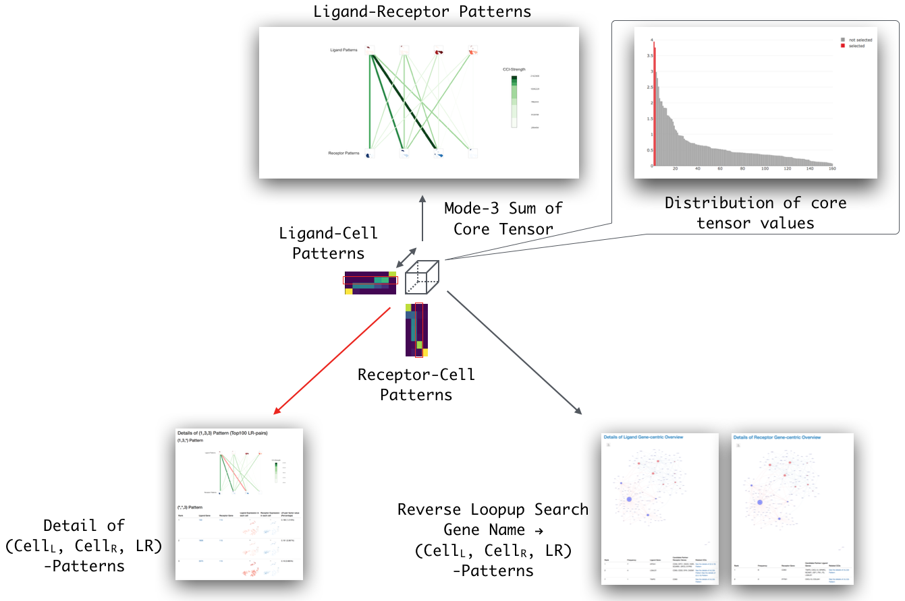

This vignette has been changed in BioC 3.14, when each data package (LRBase.XXX.eg.db) is deprecated and the way to provide LRBase data has changed to AnnotationHub-style.

# Specification change of `LRBase` and `scTensor` from BioC 3.14 (Nov. 2021)
This section is for the users of previous LRBase.XXX.eg.db-type packages and scTensor. The specifications of the LRBase.XXX.eg.db and scTensor have changed significantly since BioC 3.14. Specifically, the distribution of all LRBase.XXX.eg.db-type packages will be abolished, and the policy has been switched to one where the data is placed on a cloud server called AnnotationHub, and users are allowed to retrieve the data only when they really need it. The following are the advantages of this AnnotationHub-style.

- The installation time of the entire Bioconductor packages will be reduced.
- Old data will be archived.
- Data reproducibility is ensured (e.g. the version of the data can be specified, such as "v001").

# Introduction
## About Cell-Cell Interaction (CCI) databases

Due to the rapid development of single-cell RNA-Seq (scRNA-Seq) technologies, wide variety of cell types such as multiple organs of a healthy person, stem cell niche and cancer stem cell have been found. Such complex systems are composed of communication between cells (cell-cell interaction or CCI).

Many CCI studies are based on the ligand-receptor (L-R)-pair list of FANTOM5 project^[Jordan A. Ramilowski, A draft network of ligand-receptor-mediated multicellular signaling in human, Nature Communications, 2015] as the evidence of CCI (http://fantom.gsc.riken.jp/5/suppl/Ramilowski_et_al_2015/data/PairsLigRec.txt). The project proposed the L-R-candidate genes by following two basises.

1. **Subcellular Localization**
    1. Known Annotation (UniProtKB and HPRD) : The term **"Secreted"** for
    candidate ligand genes and **"Plasma Membrane"** for
    candidate receptor genes
    2. Computational Prediction (LocTree3 and PolyPhobius)
2. **Physical Binding of Proteins** : Experimentally validated PPI
    (protein-protein interaction) information of HPRD and STRING

The project also merged the data with previous L-R database such as
IUPHAR/DLRP/HPMR and filter out the list without PMIDs. The recent L-R databases such as CellPhoneDB and SingleCellSignalR also manually curated L-R pairs, which are not listed in IUPHAR/DLRP/HPMR. In Bader Laboratory, many putative L-R databases are predicted by their standards. In our framework, we expanded such L-R databases for **134** organisms based on the ortholog relationships. For the details, check the summary of rikenbit/lrbase-workflow^[https://github.com/rikenbit/lrbase-workflow#summary], which is the Snakemake workflow to create LRBase data in each bi-annual update of Bioconductor.

## `LRBase` and `scTensor` framework

Our L-R databases (`LRBase`) are provided a cloud server called AnnotationHub, and users are allowed to retrieve the data only when they really need it. Downloaded data is stored as a cache file on our local machines by the `r Biocpkg("BiocFileCache")` mechanism. Then, the data is converted to LRBase object by `r Biocpkg("LRBaseDbi")`. We also developed `r Biocpkg("scTensor")`, which is a method to detect CCI and the CCI-related L-R pairs simultaneously. This document provides the way to use `r Biocpkg("LRBaseDbi")`, LRBase objects, and `r Biocpkg("scTensor")` (Figure 1).


# Usage
## LRBase objects (ligand-receptor database for 134 organisms)

To create the LRBase of 134 organisms, we introduced 36 approarches including known/putative L-R pairing.
Please see the evidence code of lrbase-workflow^[https://github.com/rikenbit/lrbase-workflow].

### Data retrieval from `AnnotationHub`

First of all, we download the data of LRBase from AnnotationHub.
`AnnotationHub::AnnotationHub` retrieve the metadata of all the data stored in cloud server.

```{r AHub1, echo=FALSE}
library("AnnotationHub")
ah <- AnnotationHub()
mcols(ah)
```

Specifying some keywords in `query()`, we can find LRBase data in AnnotationHub.

```{r AHub2, echo=FALSE}
dbfile <- query(ah, c("LRBaseDb", "Homo sapiens", "v001"))[[1]]
```

AnnotationHub also keeps old data as an archive, so please make sure you have the latest version (e.g. "v002" or higher) when you search for LRBaseDb.

Then, we can convert `dbfile` into LRBase object by using `LRBaseDbi`.

```{r AHub3, echo=FALSE}
library("LRBaseDbi")
LRBase.Hsa.eg.db <- LRBaseDbi::LRBaseDb(dbfile)
```

### columns, keytypes, keys, and select

Some data access functions are available for LRBase objects.
Any data table are retrieved by 4 functions defined by
`r Biocpkg("AnnotationDbi")`; `columns`, `keytypes`, `keys`, and `select` and commonly implemented by `r Biocpkg("LRBaseDbi")` package. `columns` returns the rows which we can retrieve in LRBase objects. `keytypes` returns the rows which can be used as the optional parameter in `keys` and select functions against LRBase objects. `keys` function returns the value of keytype. `select` function returns the rows in particular columns, which are having user-specified keys. This function returns the result as a dataframe. See the vignette of `r Biocpkg("AnnotationDbi")` for more details.

```{r Access, echo=TRUE}
columns(LRBase.Hsa.eg.db)
keytypes(LRBase.Hsa.eg.db)
key_HSA <- keys(LRBase.Hsa.eg.db, keytype="GENEID_L")
head(select(LRBase.Hsa.eg.db, keys=key_HSA[1:2],
            columns=c("GENEID_L", "GENEID_R"), keytype="GENEID_L"))
```

### Other functions

Other additional functions like `species`, `nomenclature`, and `listDatabases` are available. In each LRBase.XXX.eg.db-type package, `species` function returns the common name and `nomenclature` returns the scientific name. `listDatabases` function returns the source of data. `dbInfo` returns the information of the package. `dbfile` returns the directory where sqlite file is stored. `dbschema` returns the schema of the database. `dbconn` returns the connection to the sqlite database.

```{r Other1, echo=TRUE}
lrNomenclature(LRBase.Hsa.eg.db)
species(LRBase.Hsa.eg.db)
lrListDatabases(LRBase.Hsa.eg.db)
lrVersion(LRBase.Hsa.eg.db)

dbInfo(LRBase.Hsa.eg.db)
dbfile(LRBase.Hsa.eg.db)
dbschema(LRBase.Hsa.eg.db)
dbconn(LRBase.Hsa.eg.db)
```

Combined with `dbGetQuery` function of `r CRANpkg("RSQLite")` package,
more complicated queries also can be submitted.

```{r Other2, echo=TRUE}
suppressPackageStartupMessages(library("RSQLite"))
dbGetQuery(dbconn(LRBase.Hsa.eg.db),
  "SELECT * FROM DATA WHERE GENEID_L = '9068' AND GENEID_R = '14' LIMIT 10")
```

## `scTensor` (CCI-tensor construction, decomposition, and HTML reporting)

Combined with LRBase object and user's gene expression matrix of scRNA-Seq, `r Biocpkg("scTensor")` detects CCIs and generates HTML reports for exploratory data inspection. The algorithm of `r Biocpkg("scTensor")` is as follows.

Firstly, `r Biocpkg("scTensor")` calculates the celltype-level mean vectors, searches the corresponding pair of genes in the row names of the matrix, and extracted as two vectors.

Next, the cell type-level mean vectors of ligand expression and that of receptor expression are multiplied as outer product and converted to cell type $\times$ cell type matrix. Here, the multiple matrices can be represented as a three-order "tensor" (Ligand-Cell * Receptor-Cell * L-R-Pair). `r Biocpkg("scTensor")` decomposes the tensor into a small tensor (core tensor) and two factor matrices. Tensor decomposition is very similar to the matrix decomposition like PCA (principal component analysis). The core tensor is similar to the eigenvalue of PCA; this means that how much the pattern is outstanding. Likewise, three matrices are similar to the PC scores/loadings of PCA; These represent which ligand-cell/receptor-cell/L-R-pair are informative. When the matrices have negative values, interpreting which direction (+/-) is important and which is not, is a difficult and laboring task. That's why, `r Biocpkg("scTensor")`
performs non-negative Tucker2 decomposition (NTD2), which is non-negative version of tensor decomposition (cf. `r CRANpkg("nnTensor")`).

Finally, the result of NTD2 is summarized as an HTML report. Because most of the plots are visualized by `r CRANpkg("plotly")` package, the precise information of the plot can be interactively confirmed by user's on-site web browser. The two factor matrices can be interactively viewed and which cell types and which L-R-pairs are likely to be interacted each other. The mode-3 (LR-pair direction) sum of the core tensor is calculated and visualized as Ligand-Receptor Patterns. Detail of (Ligand-Cell, Receptor-Cell, L-R-pair) Patterns are also visualized.

### Creating a `SingleCellExperiment` object

Here, we use the scRNA-Seq dataset of male germline cells and somatic cells$^{3}$[GSE86146](https://www.ncbi.nlm.nih.gov/geo/query/acc.cgi?acc=GSE86146) as demo data. For saving the package size, the number of genes is strictly reduced by the standard of highly variable genes with a threshold of the p-value are 1E-150 (cf. [Identifying highly variable genes](http://pklab.med.harvard.edu/scw2014/subpop_tutorial.html)). That's why we won't argue about the scientific discussion of the data here.

We assume that user has a scRNA-Seq data matrix containing expression count data summarised at the level of the gene. First, we create a `r Biocpkg("SingleCellExperiment")` object containing the data. The rows of the object correspond to features, and the columns correspond to cells. The gene identifier is limited as NCBI Gene ID for now.

To improve the interpretability of the following HTML report, we highly recommend that user specifies the two-dimensional data of input data (e.g. PCA, t-SNE, or UMAP). Such information is easily specified by `reducedDims` function of `r Biocpkg("SingleCellExperiment")` package and is saved to reducedDims slot of `SingleCellExperiment` object (Figure \@ref(fig:cellCellSetting)).

```{r SCE1, echo=FALSE}
suppressPackageStartupMessages(library("scTensor"))
suppressPackageStartupMessages(library("SingleCellExperiment"))
```

```{r SCE2, fig.cap="Germline, Male, GSE86146", echo=TRUE, fig.width=10, fig.height=10}
data(GermMale)
data(labelGermMale)
data(tsneGermMale)

sce <- SingleCellExperiment(assays=list(counts = GermMale))
reducedDims(sce) <- SimpleList(TSNE=tsneGermMale$Y)
plot(reducedDims(sce)[[1]], col=labelGermMale, pch=16, cex=2,
  xlab="Dim1", ylab="Dim2", main="Germline, Male, GSE86146")
legend("topleft", legend=c(paste0("FGC_", 1:3), paste0("Soma_", 1:4)),
  col=c("#9E0142", "#D53E4F", "#F46D43", "#ABDDA4", "#66C2A5", "#3288BD", "#5E4FA2"),
  pch=16)
```

### Parameter setting: `cellCellSetting`

To perform the tensor decomposition and HTML report, user is supposed to specify

- 1. LRBaseDb object (e.g. LRBase.Hsa.eg.db)
- 2. cell type vector of each cell (e.g. names(labelGermMale))

to `SingleCellExperiment` object.

```{r cellCellSetting, echo=TRUE}
cellCellSetting(sce, LRBase.Hsa.eg.db, names(labelGermMale))
```

The corresponding information is registered to the metadata slot of `SingleCellExperiment` object by `cellCellSetting` function.

### CCI-tensor construction and decomposition: `cellCellDecomp`

After `cellCellSetting`, we can perform tensor decomposition by `cellCellDecomp`. Here the parameter `ranks` is specified as dimension of core tensor. For example, c(2, 3) means The data tensor is decomposed to 2 ligand-patterns and 3 receptor-patterns.

```{r cellCellDecomp, echo=TRUE}
set.seed(1234)
cellCellDecomp(sce, ranks=c(2,3))
```

Although user has to specify the rank to perform cellCellDecomp, we implemented a simple rank estimation function based on the eigenvalues distribution of PCA in the matricised tensor in each mode in `cellCellRank`. `rks$selected` is also specified as rank parameter of `cellCellDecomp`.

```{r cellCellRank, echo=TRUE}
(rks <- cellCellRanks(sce))
rks$selected
```

### HTML Report: `cellCellReport`

If `cellCellDecomp` is properly finished, we can perform `cellCellReport` function to output the HTML report like below. Please type `example(cellCellReport)` and the report will be generated in the temporary directory (it costs 5 to 10 minutes). After `cellCellReport`, multiple R markdown files, compiled HTML files, figures, and R binary file containing the result of analysis are saved to `out.dir` (Figure 2). For more details, open the `index.html` by your web browser. Combined with cloud storage service such as Amazon Simple Storage Service (S3), it can be a simple web application and multiple people like collaborators can confirm the same report simultaneously.



# Session Information {.unnumbered}

```{r sessionInfo, echo=FALSE}
sessionInfo()
```